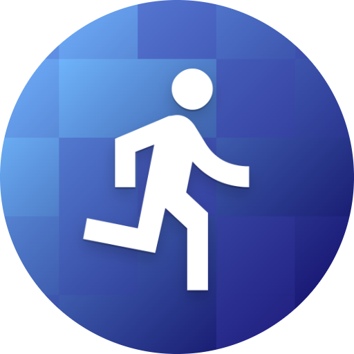

    <ul style="list-style-type: none; margin: 0; padding: 0; display: flex; justify-content: center;">
        <li><a href="#privacy">Privacy Policy</a></li>
    </ul>

    
    

        <h1>Welcome to RunWear</h1>
        
Your ultimate companion for a perfect running experience! RunWear is more than just a weather app; it's your personal outfit advisor designed specifically for runners. No more guessing what to wear when you head out for a run—let RunWear take care of that for you!

    

## Key Features

- **Real-time Weather Updates:** RunWear fetches real-time weather data based on your current location, ensuring you always have the latest weather information at your fingertips.
- **Running Clothing Recommendations:** Based on the weather conditions, RunWear recommends the ideal clothing and gear for your run. Whether it's sunny, rainy, cold, or hot, RunWear suggests the perfect outfit to keep you comfortable throughout your run.

## Why Choose RunWear?

- **Convenience:** Say goodbye to last-minute outfit dilemmas. With RunWear, you'll always be prepared for your run.
- **Performance:** Dressing appropriately for the weather can enhance your running performance and overall comfort. Let RunWear optimize your running experience.

## Get Started with RunWear Today!

Download RunWear now and experience a new level of convenience and comfort in your running routine. Let the weather guide your outfit choices, so you can focus on what you love—running!

---

# Privacy Policy {#privacy}

This Privacy Policy describes how RunWear ("we," "us," or "our") collects, uses, and discloses information when you use our mobile application RunWear (the "App").

## Information Collection and Use

The App does not collect or store any personal data from users. However, the App may utilize your device's GPS location services to retrieve weather information relevant to your current location. This location data is used solely for the purpose of providing weather-related services within the App.

## Location Data

When you use the App, we may collect and process information about your device's GPS location. This location data is used to obtain weather forecasts and perform calculations based on your current location. We do not store or share your precise location data with third parties.

## Data Retention

We do not retain any location data or personal information collected through the App. Your location information is only used temporarily to provide the requested weather-related services while using the App.

## Third-Party Services

The App may utilize third-party services, such as weather data providers, to obtain weather information. These third-party services have their own privacy policies governing the collection and use of data. We recommend reviewing the privacy policies of these third-party services for more information.

## Children's Privacy

The App is not intended for use by children under the age of 13. We do not knowingly collect personal information from children under 13. If you are a parent or guardian and believe that your child has provided us with personal information, please contact us, and we will take steps to remove such information from our systems.

## Changes to This Privacy Policy

We may update our Privacy Policy from time to time. Any changes to this Privacy Policy will be posted on this page. You are advised to review this Privacy Policy periodically for any changes.

## Contact Us

If you have any questions or concerns about our Privacy Policy or the App's data practices, please contact us at [marc@deeplink.co.uk](mailto:marc@deeplink.co.uk).

This Privacy Policy was last updated on 12/05/2024.
